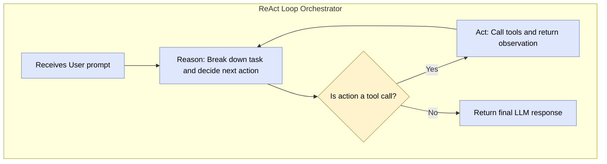

GenAI agent capable of understanding user requests, reasoning about them, and using a set of tools to accomplish complex tasks. This project serves as a robust backend orchestrator, built with Spring Boot, that follows a ReAct-style reasoning loop to interact with Large Language Models (LLMs) and external APIs.

---

## 🏛️ System Architecture

The core of this project is built around the **Strategy Design Pattern** to create a flexible and pluggable orchestration layer. This approach insulates the application from the volatile nature of AI technology, allowing different agentic engines to be developed, tested, and swapped with a simple configuration change.

This design provides two key benefits:

1.  **Initial Speed:** Allows for rapid prototyping with high-level frameworks.
2.  **Long-term Flexibility:** Enables the development of custom, fine-tuned orchestration logic without a system-wide rewrite.

### Architectural Diagram

The diagram below illustrates this pluggable architecture. The `API Controller` depends only on the `AIOrchestrator` interface, completely decoupling it from the specific implementation details.



---

### 🧱 Key Components

#### Shared Components

- **API Controller**: The REST entry point. It depends _only_ on the `AIOrchestrator` interface.
- **AIOrchestrator (Interface)**: The core service contract that defines how the application interacts with any agentic engine.

#### Pluggable Implementations

- **Custom ReAct Orchestrator (`@Profile("custom")`)**: The default, hand-built implementation that uses a ReAct-style reasoning loop. It contains the following sub-components:
  - **LLM Client**: Makes calls to the external LLM.
  - **Tool Dispatcher**: Executes tool logic.
  - **Tool Registry**: Stores definitions of available tools.
- **Embabel Orchestrator (`@Profile("embabel")`)**: An alternative implementation that delegates orchestration logic to the high-level Embabel framework.

---

### 🔄 Interaction Flow (Custom ReAct Implementation)

The custom orchestrator uses an orchestrated, multi-step reasoning loop:



---

## 🛠️ Technology Stack

- **Framework**: Spring Boot 3.x
- **Language**: Java 25+
- **Build Tool**: Maven / Gradle
- **Containerization**: Docker

---

## 🚀 Getting Started

### Prerequisites

- Java JDK 25 or later
- Maven or Gradle installed
- An API Key for an LLM provider (e.g., OpenAI)

### Installation & Running

1.  **Clone the repository:**

    ```sh
    git clone https://github.com/ndenniszhang/genai-orchestrator
    cd genai-orchestrator
    ```

2.  **Configure your API Key:**
    Open `src/main/resources/application.properties` and add your credentials:

    ```properties
    llm.api.key=YOUR_API_KEY_HERE
    ```

3.  **Build and run the application:**
    ```sh
    # Run the Embabel orchestrator (default)
    ./mvnw spring-boot:run
    ```
    ```sh
    # Or run the Custom ReAct orchestrator
    ./mvnw spring-boot:run -Dspring.profiles.active=custom
    ```

The application will be running on `http://localhost:8080`.

### Example API Call

You can interact with GenAI Orchestrator using a simple cURL request:

```sh
curl -X POST http://localhost:8080/api/v1/agent \
-H "Content-Type: application/json" \
-d '{
  "prompt": "What is the weather in New York?"
}'
```
