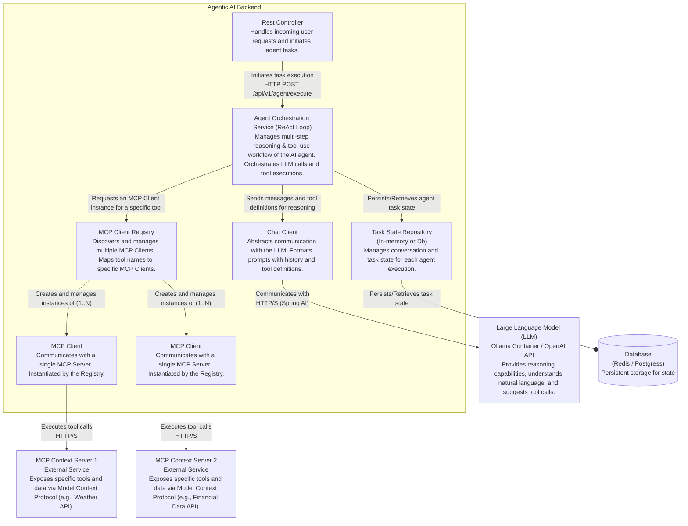

GenAI agent capable of understanding user requests, reasoning about them, and using a set of tools to accomplish complex tasks. This project serves as a robust backend orchestrator, built with Spring Boot, that follows a ReAct-style reasoning loop to interact with Large Language Models (LLMs) and external APIs.

---

## 🏛️ System Architecture (MVP)

The GenAI Orchestrator MVP is designed as a **monolithic Spring Boot application** using a **layered architectural pattern**. This approach prioritizes simplicity and rapid development for the initial version while maintaining a clear separation of concerns.

### Component Diagram

The diagram below illustrates the key components within the GenAI Orchestrator monolith and its interactions with external systems.



---

### 🧱 Key Components

- **API Controller**: A standard Spring REST controller that serves as the entry point for all external user requests.
- **Agent Loop Orchestrator**: The brain of the application. This central service manages the entire reasoning loop, coordinating all other internal components to process a user's request from start to finish.
- **MCP Assembler**: The "Model Context Protocol" Assembler is responsible for creating a structured JSON payload to send to the LLM. It gathers conversation history, available tool definitions from the `Tool Registry`, and the current user request.
- **LLM Client**: A dedicated client component responsible for making HTTP calls to an external Large Language Model API (e.g., OpenAI).
- **Tool Dispatcher**: An adapter service that contains the concrete Java implementations for all available tools (e.g., methods like `turnOnLight(String deviceName)`). It translates the LLM's `tool_call` into an actual method invocation.
- **Tool Registry**: An in-memory or configuration-based component that stores the function signatures and descriptions of all tools available to the agent.

---

### 🔄 Interaction Flow

GenAI Orchestrator uses an orchestrated, multi-step reasoning loop to fulfill requests:


---

## 🛠️ Technology Stack

- **Framework**: Spring Boot 3.x
- **Language**: Java 25+
- **Build Tool**: Maven / Gradle
- **Containerization**: Docker

---

## 🚀 Getting Started

### Prerequisites

- Java JDK 25 or later
- Maven or Gradle installed
- An API Key for an LLM provider (e.g., OpenAI)

### Installation & Running

1.  **Clone the repository:**

    ```sh
    git clone https://github.com/ndenniszhang/genai-orchestrator
    cd genai-orchestrator
    ```

2.  **Configure your API Key:**
    Open `src/main/resources/application.properties` and add your credentials:

    ```properties
    llm.api.key=YOUR_API_KEY_HERE
    ```

3.  **Build and run the application:**
    ```sh
    ./mvnw spring-boot:run
    ```

The application will be running on `http://localhost:8080`.

### Example API Call

You can interact with GenAI Orchestrator using a simple cURL request:

```sh
curl -X POST http://localhost:8080/api/v1/agent \
-H "Content-Type: application/json" \
-d '{
  "prompt": "Turn on the living room lights."
}'
```

---

## 🗺️ Roadmap (Future Work)

The current MVP is a solid foundation. Future enhancements could include:

- **Persistent Conversation History**: Integrate a database (e.g., PostgreSQL) to maintain state across multiple user interactions.
- **Dynamic Tool Loading**: Allow tools to be added or removed without restarting the application.
- **Asynchronous Execution**: Implement support for long-running tools that don't block the main agent loop.
- **Microservices for Tools**: For enhanced scalability, refactor the `Tool Dispatcher` to communicate with external microservices.
